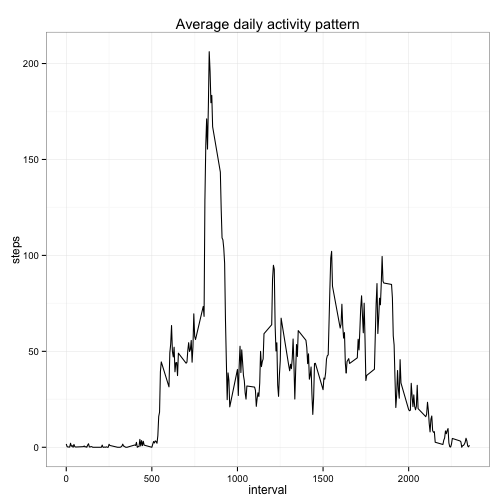

```r
# loading required libraries

library(dplyr)
library(stringr)
library(ggplot2)
library(lattice)
library(knitr)

# setting the working dir
setwd('/Users/iLeo/moocs/Coursera-Data-Science/Reproducible-Research/RepData_PeerAssessment1')
```

## Loading and preprocessing the data

```r
steps <- read.csv('./activity.csv')

# filtering out the NA values
steps_per_day <- steps %>%
                    filter(!is.na(steps)) %>%
                    group_by(date) %>%
                    summarize(steps = sum(steps))

# plotting the histogram
hist(steps_per_day$steps,main = 'Total steps per day', xlab='steps', breaks = 20)
```

 


## What is mean total number of steps taken per day?

```r
mean(steps_per_day$steps)
```

```
## [1] 10766.19
```

## What is median total number of steps taken per day?

```r
median(steps_per_day$steps)
```

```
## [1] 10765
```


## What is the average daily activity pattern?

```r
pattern <- steps %>%
  filter(!is.na(steps)) %>%
  select(interval, steps) %>%
  group_by(interval) %>%
  summarize(steps = mean(steps))

p <- ggplot(data=pattern, aes(x=interval, y=steps)) + geom_line() + theme_bw() + labs(title='Average daily activity pattern')

print(p)
```

 

### Which 5-minute interval, on average across all the days in the dataset, contains the maximum number of steps?

```r
steps_pattern_by_5_mins_interval <- steps %>%
                                    filter(!is.na(steps)) %>%
                                    group_by(interval) %>%
                                    summarize(steps = mean(steps))

padded_intervals <- str_pad(steps$interval, 4, side='left', pad='0')

hours <- str_sub(padded_intervals, 1, 2)

mins <- str_sub(padded_intervals, 3, 4)

steps$five_mins_interval <- paste(hours, ':', mins, sep = '')

idx_max_steps <- which(steps_pattern_by_5_mins_interval$steps == max(steps_pattern_by_5_mins_interval$steps))

steps[idx_max_steps,]$interval
```

```
## [1] 835
```

which corresponds to this hour and 5-mins interval:  

```r
steps[idx_max_steps,]$five_mins_interval
```

```
## [1] "08:35"
```

## Imputing missing values

### Number of rows with NA values

```r
steps_with_na <- steps[is.na(steps$steps),]
nrow(steps_with_na)
```

```
## [1] 2304
```


As simple filling strategy we choose to use the mean calculated in the previous steps

```r
inferred.values <- merge(steps[is.na(steps$steps),], steps_pattern_by_5_mins_interval, by="interval")[,c('interval', 'date', 'steps.y')]

names(inferred.values) <- c('interval', 'date', 'steps')

merged.steps.df <- merge(steps, inferred.values, by = c('interval', 'date'),all.x = T)

merged.steps.df[is.na(merged.steps.df$steps.x),]$steps.x = merged.steps.df[is.na(merged.steps.df$steps.x),]$steps.y

full.steps.df <- merged.steps.df[,c('interval', 'date', 'steps.x')]

names(full.steps.df) <- c('interval', 'date', 'steps')


revised.steps_per_day <- full.steps.df %>%
                    group_by(date) %>%
                    summarize(steps = sum(steps))

hist(revised.steps_per_day$steps,main = 'Total steps per day', xlab='steps', breaks = 10)
```

 

additional check to show that there are no more NA values in our filled dataframe:


```r
nrow(revised.steps_per_day[is.na(revised.steps_per_day$steps),])
```

```
## [1] 0
```

## What is mean total number of steps taken per day?
The mean calculated with imputed values is identical to the mean calculated on the original data with NA's

```r
mean(revised.steps_per_day$steps)
```

```
## [1] 10766.19
```

## What is median total number of steps taken per day?
The median is almost equal.

```r
median(revised.steps_per_day$steps)
```

```
## [1] 10766.19
```


## Are there differences in activity patterns between weekdays and weekends? 

```r
full.steps.df$day <- NA

full.steps.df[which(weekdays(as.Date(full.steps.df$date)) %in% c("Saturday", "Sunday")),]$day <- 'weekend'

full.steps.df[is.na(full.steps.df$day),]$day <- 'weekday'

full.steps.df$day <- ordered(as.factor(full.steps.df$day), levels=c("weekday", 'weekend'))

grouped.by.day <- full.steps.df %>%
                                    group_by(day, interval) %>%
                                    summarize(steps = mean(steps))

xyplot(steps ~ interval | day, data=grouped.by.day,  type="l", layout=c(1,2))
```

 

While in the weekdays we can observe a 'spike' in the average number of steps taken in the morning (as stated in the first chunks of this analysis) during the weekend the average number of steps taken is more distributed across the day, probably because not being at work, people can just go out for a walk / engage in some sport.
